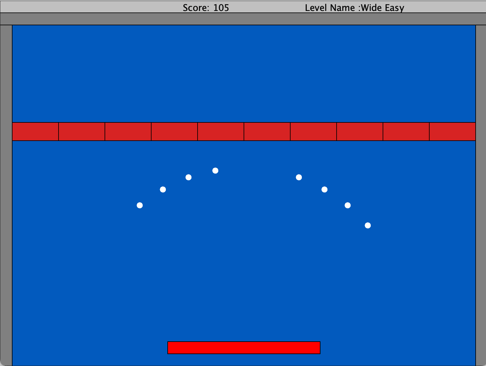
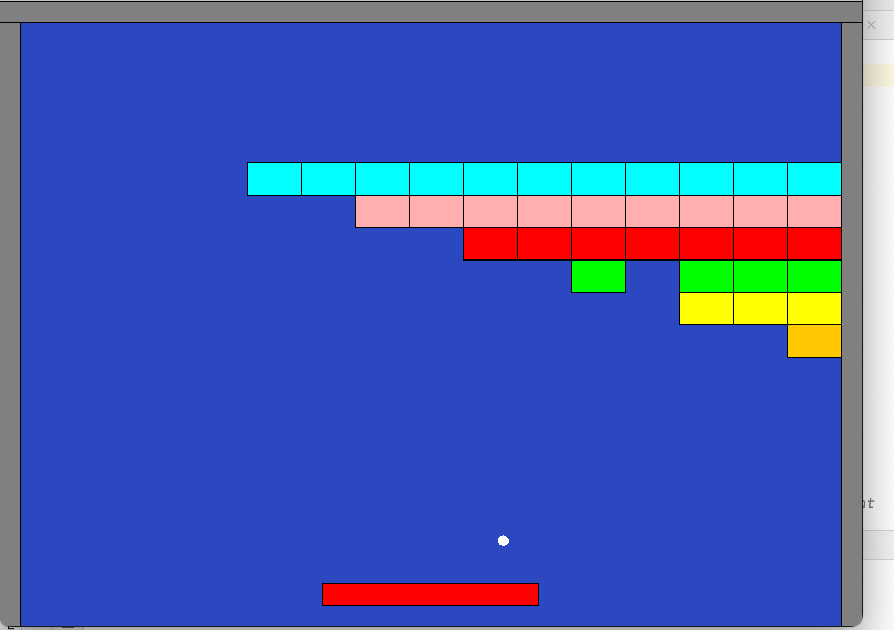
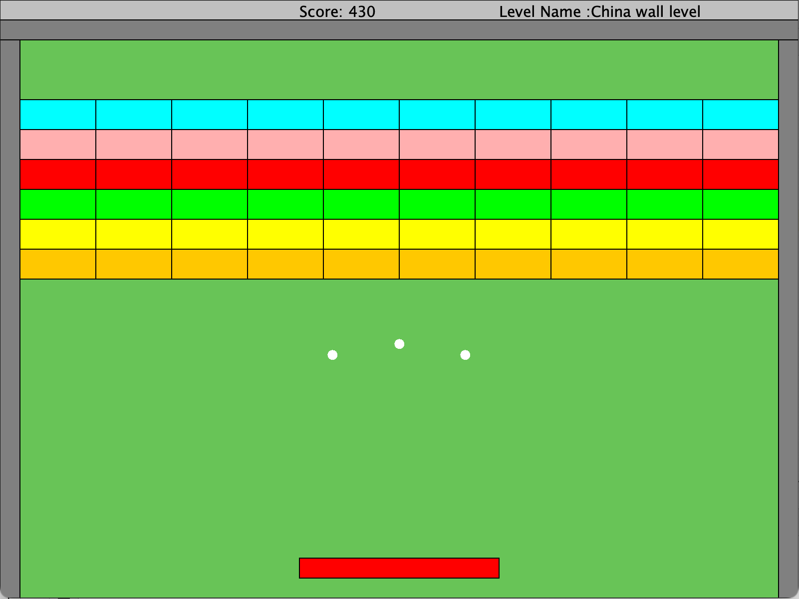
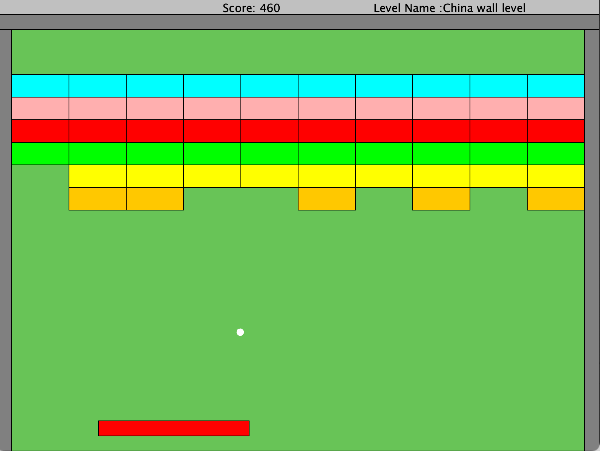

# Arkanoid-Game project
#### welcome to my projects page

## about the project
* The projects is written in java
* Level based object-oriented programming (OOP)
* Each item in the game is represented by a class

## Description of the game
 * The game contains 4 levels , to win the game the player must pass all the level
 * The game has a score system , the player can see the score in the game
 * Each player have 3 lives , if the player lose all the lives the game is over
 * You can pause the game when click on p button, and resume the game when click on p button

## Preview of the game

